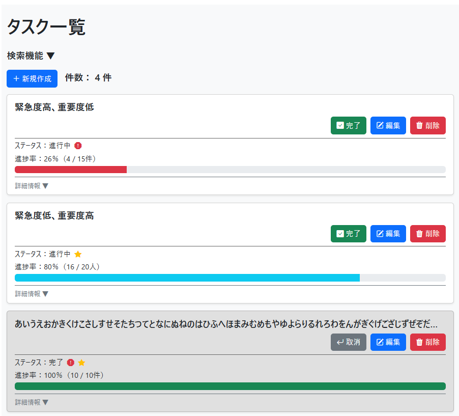
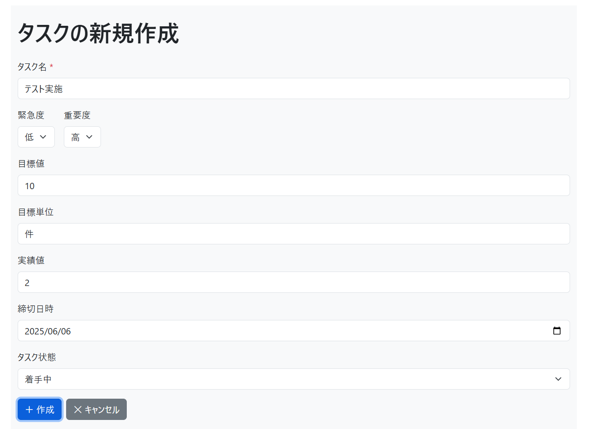

# 📋 タスク管理アプリ（Django）

本アプリは、Django フレームワークを使って作成したタスク管理アプリケーションです。
単なるタスク登録・編集にとどまらず、緊急度・重要度の設定や、
進捗管理のための目標・実績値の入力や進捗率の自動計算機能及び進捗率の状態を視覚的に表すバーを備えています。
このため、タスクの進捗状況を視覚的に確認でき、優先度と達成度を軸に効率的なタスク管理を可能にします。

---

## 🚀 使用技術

- Python 3.13.2
- Django 5.2
- HTML（テンプレート）
- Bootstrap 5.3.0（スタイル調整、※CDN 利用）
- SQLite（開発用 DB）

---

## 🧩 主な機能

- タスクの一覧表示（トップページ）
- タスクの新規作成・編集・削除（削除はモーダル確認あり）
- タスクの完了状態切り替え（進捗率・完了日時を自動補完）
- 緊急度・重要度の設定（選択式）
- 目標・実績の入力（任意）
- 進捗率の自動計算（目標・実績が両方設定されている場合）
- 進捗率の視覚化（バーの色の変化：赤、黄、水色、緑）
- 更新日時、作成日時、締切日時（任意）、完了日時の記録・表示
- 未入力・未設定項目へのデフォルト表示（例：「-」など）
- 条件検索（部分一致、数値一致、日付範囲に対応）
- 検索結果の件数表示
- デフォルトの並び順は「作成日時の降順」
- アラート機能（メッセージ通知、フィールドエラー、フォーム全体）

---

## 🌐 URL 構成

- `/todos/` - タスク一覧（トップページ）
- `/todos/create/` - タスク新規作成
- `/todos/<task_id>/update/` - タスク編集
- `/todos/<task_id>/delete/` - タスク削除
- `/todos/<task_id>/complete/` - タスクを完了にする
- `/todos/<task_id>/uncomplete/` - タスクの完了を取り消す

---

## 🔍 使い方

1. トップページでタスク一覧を確認（検索可能）
2. 「新規作成」からタスク登録（必須／任意項目あり）
3. 編集ボタンでタスクの内容を更新
4. 削除ボタンを押すとモーダルが表示され、確認後に削除を実行
5. 「完了」ボタンを押すとステータスが切り替わり、必要に応じて進捗も自動補完
6. 検索フォームで条件を絞り込み可能（条件をクリアして全件表示も可）

---

## 📷 画面キャプチャ

### 1．タスクの一覧表示画面



### 2．タスクの新規作成画面



### 3．タスクの編集画面


### 4．タスクの削除モーダル


---

## 🧠 実装上の工夫と最適化ポリシー

- 検索機能における範囲検索処理は get_search_date() 関数で共通化
- 日付入力欄の定義も get_date_form() により簡潔化
- status の切り替えロジックは change_complete() に集約し、重複処理を防止
- 複数ボタンの処理分岐には、GET['action'] の値による分岐設計
- 本アプリで使用するメッセージは messages_def.py に辞書形式にて管理
- アイコンは templatetags フォルダに icon_tags.py を配置し管理

---

## 🔐 セキュリティとバリデーション対策

- 年の 6 桁入力防止：HTML5 の`max="9999-12-31"`に加え、Django 側の`clean_xxx()`バリデーションを実装
- 日付欄は「1900 年 1 月 1 日～ 9999 年 12 月 31 日」の範囲で制限
- 値の不整合チェック：`clean()` メソッドにて「開始日 ≦ 終了日」などの整合性をサーバー側で再検証
- 実績値・目標値のマイナス入力防止：カスタムバリデーターで動的にチェックを付加
- 検索フォームのクリアボタンには `formnovalidate` 属性を付け、意図的にバリデーションをスキップ
- CSRF 対策：全 POST フォームに``を実装済

---

## 💡 検索機能における UX 工夫

- 検索フォームは Bootstrap の Collapse により折りたたみ可能
- 検索件数は新規作成ボタンの横に表示し、直感的な把握を促進
- 検索とクリアボタンは name='action' の GET パラメータに 'search'／'clear' を設定することで判別しています。

---

## 💬 メッセージ運用方針

本アプリで表示されるメッセージ（アラート）は、ユーザーへの通知・警告・エラー伝達を体系的に管理しています。

- 共通設計：messages_def.py にて、番号・内容・表示レベル（success / warning / danger）を一元管理
- 分類ルール：
  - 1000 番台：正常系（登録完了、更新完了など）
  - 2000 番台：エラー系（未入力、形式不正など）
  - 3000 番台：情報系（検索結果など）
  - 4000 番台：注意系（進捗計算不能、削除確認など）
  - 9000 番台：システムエラー系（予期せぬエラーなど）
- 表示方式：
  - Django の messages フレームワークでメッセージを送信
  - Bootstrap アラートで画面上部に通知（自動閉じ可能）
- 保守性重視：メッセージは辞書＋関数 (add_message()) で出力することで再利用・修正に強い設計としています。

---

## 📁 ディレクトリ構成（抜粋）

```
プロジェクトルート/
├── config/                    # プロジェクト設定
│   ├── settings.py            # 設定ファイル
│   ├── urls.py                # プロジェクトURL設定
│   └── ...
├── static/                    # CSS/JS/画像
│   ├── image                  # 画像ファイル
│   └── style.css              # CSSファイル
├── templates/
│   └── base.html              # 共通テンプレート
├── todos/                     # アプリ本体
│   ├── models.py              # モデル（Todo定義）
│   ├── views.py               # ビュー関数
│   ├── forms.py               # フォーム
│   ├── urls.py                # URLルーティング
│   ├── utils/                 # メッセージ処理
│   │   ├── message_helper.py  # メッセージの処理ロジック
│   │   └── messages_def.py    # メッセージの定義（辞書）
│   ├── templates/
│   │   └── todos/
│   │       ├── index.html     # 一覧表示画面
│   │       ├── create.html    # 新規作成画面
│   │       └── update.html    # 編集画面
|   └── templatetags/
│       └── icon_tags.py       # アイコン取得用
├── manage.py                  # 管理スクリプト
└── requirements.txt           # 依存パッケージ
```

---

## ⚙️ セットアップ手順（ローカル開発環境）

```bash
# リポジトリのクローン
git clone https://github.com/Ogimatsu/MyTodoApp
cd MyTodoApp

# 仮想環境の作成
python -m venv venv

# 仮想環境の有効化（OS別）
# Mac/Linuxの場合
source venv/bin/activate

# Windowsの場合
venv\Scripts\activate

# 必要パッケージのインストール
pip install -r requirements.txt

# マイグレーション実行
python manage.py migrate

# サーバー起動
python manage.py runserver
```

---

## 👨‍💻 開発者向け情報

- テストの実行: `python manage.py test`
- コードスタイル: PEP 8 に準拠
- 開発環境: `.editorconfig`ファイルを参照
- 管理画面の利用（オプション）:
  - 管理ユーザーの作成: `python manage.py createsuperuser`
  - 管理画面アクセス: http://127.0.0.1:8000/admin/
  - ※ `Todo` モデルを `admin.py` に登録しておくと、GUI でデータ確認・編集も可能です

---

## 🌱 Git 運用方針

- main: 本番用、常にデプロイ可能な状態
- feature/〇〇: 機能ごとの開発ブランチ（例：feature/search-function）
- コミットメッセージはプレフィックス付きで明確に（例：fix:, feat:）

---

## 📅 今後の開発予定

- ログイン・ユーザー別タスク管理の実装
- AWS デプロイ、環境変数管理、セキュリティ強化の対応
