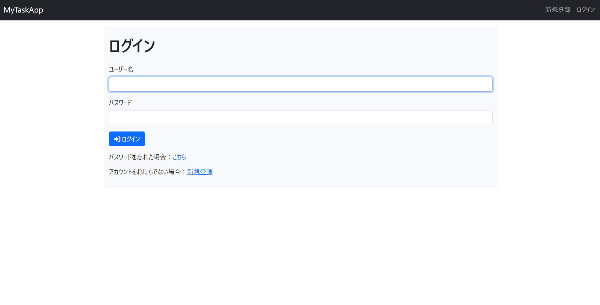
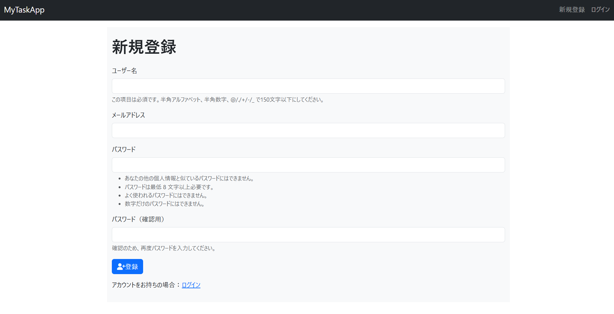
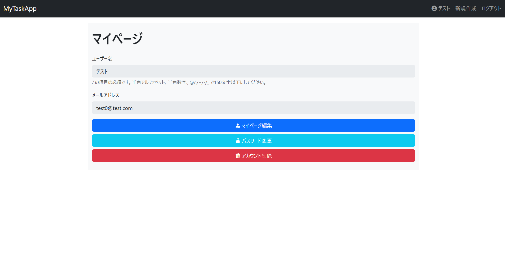
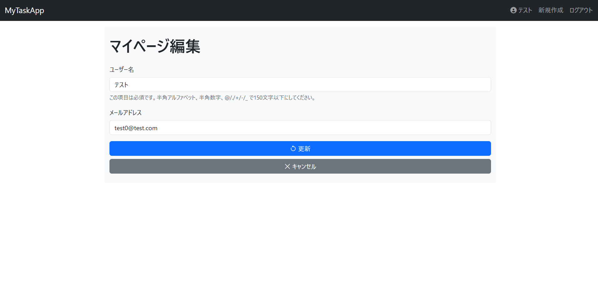
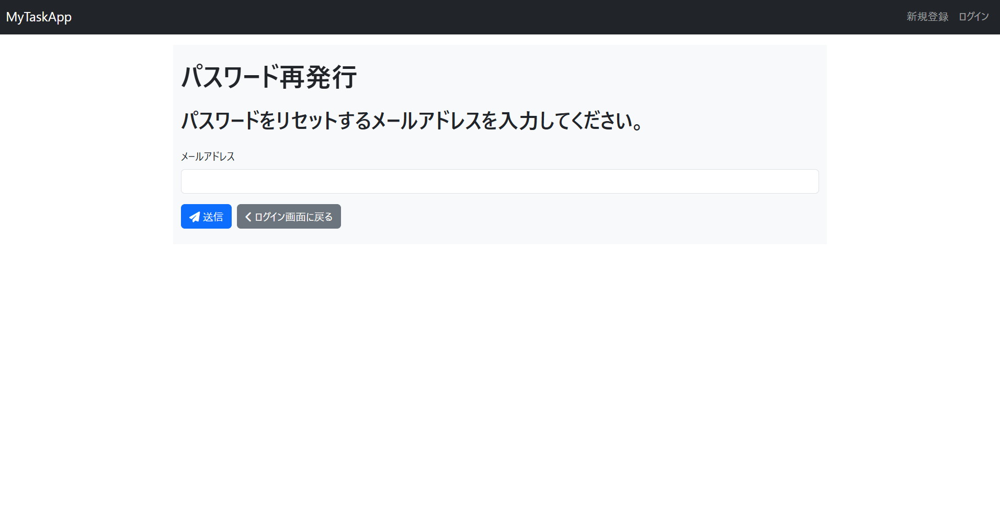
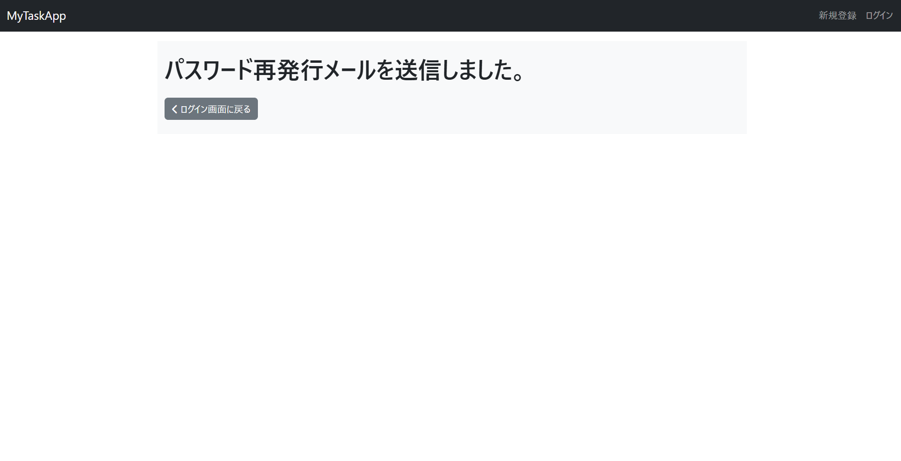
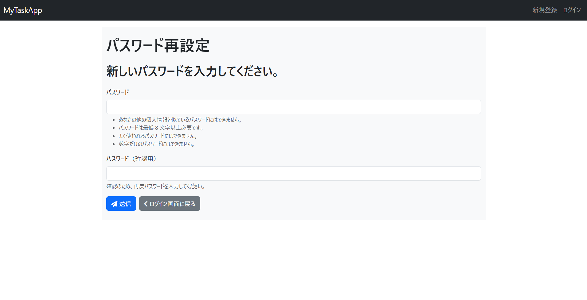

## 目次

- [タスク管理アプリ（Django）](#タスク管理アプリdjango)
- [使用技術](#使用技術)
- [主な機能](#主な機能)
- [URL 構成](#url-構成)
- [使い方](#使い方)
- [画面キャプチャ](#画面キャプチャ)
- [実装上の工夫と最適化ポリシー](#実装上の工夫と最適化ポリシー)
- [セキュリティとバリデーション対策](#セキュリティとバリデーション対策)
- [検索機能における UX 工夫](#検索機能における-ux-工夫)
- [メッセージ運用方針](#メッセージ運用方針)
- [ディレクトリ構成（抜粋）](#ディレクトリ構成抜粋)
- [セットアップ手順（ローカル開発環境）](#セットアップ手順ローカル開発環境)
- [開発者向け情報](#開発者向け情報)
- [使用パッケージについて](#使用パッケージについて)
- [Git 運用方針](#git-運用方針)
- [今後の開発予定](#今後の開発予定)
- [対応済みの開発項目](#対応済みの開発項目)

---

# タスク管理アプリ（Django）

本アプリは、Django フレームワークを使って作成したタスク管理アプリケーションです。
単なるタスク登録・編集にとどまらず、緊急度・重要度の設定や、
進捗管理のための目標・実績値の入力、進捗率の自動計算機能、さらに進捗率の状態を視覚的に表すバーを備えています。
このため、タスクの進捗状況を視覚的に確認でき、優先度と達成度を軸に効率的なタスク管理を可能にします。
また、ユーザーごとの認証機能を備えており、自分のタスクだけを安全に管理・操作できるようになっています。
さらに、マイページも備えており、そこからユーザー名等の情報の変更もできるようになっています。

---

## 使用技術

- Python 3.13.2
- Django 5.2
- HTML（テンプレート）
- Bootstrap 5.3.0（スタイル調整、※CDN 利用）
- SQLite（開発用 DB）

---

## 主な機能

- タスクの一覧表示（トップページ）
- タスクの新規作成・編集・削除（削除はモーダル確認あり）
- タスクの完了状態切り替え（進捗率・完了日時を自動補完、完了時は背景をグレーに変更）
- 緊急度・重要度の設定（選択式）
- 目標・実績の入力（任意）
- 進捗率の自動計算（目標・実績が両方設定されている場合）
- 進捗率の視覚化（バーの色の変化：赤、黄、水色、緑）
- 更新日時、作成日時、締切日時（任意）、完了日時の記録・表示
- 未入力・未設定項目へのデフォルト表示（例：「-」など）
- 条件検索（部分一致、数値一致、日付範囲に対応）
- 検索結果の件数表示
- デフォルトの並び順は「作成日時の降順」
- アラート機能（メッセージ通知、フィールドエラー、フォーム全体）
- ユーザー登録・ログイン・ログアウト機能（認証済ユーザーのみが操作可能）
- アカウント削除機能（削除時は確認モーダル表示後、ログイン画面に遷移）
- マイページ画面（ユーザー情報編集、パスワード変更）
- パスワード再設定機能（メールで送信されたパスワード再発行用 URL より再設定）

---

## URL 構成

- `/todos/` - タスク一覧（ログイン時のトップページ）
- `/todos/create/` - タスク新規作成
- `/todos/<task_id>/update/` - タスク編集
- `/todos/<task_id>/delete/` - タスク削除
- `/todos/<task_id>/complete/` - タスク完了
- `/todos/<task_id>/uncomplete/` - タスク完了取消
- `/login/` - ログイン（非ログイン時のトップページ）
- `/logout/` - ログアウト
- `/signup/` - ユーザー新規登録
- `/password_reset/` - パスワード再発行フォーム
- `/password_reset/done/` - パスワード再発行メール送信完了
- `/reset/<uidb64>/<token>/` - パスワード再設定（メール内リンクから遷移）
- `/reset/done/` - パスワード再設定完了
- `/mypage/` - マイページ
- `/mypage/update/` - マイページ編集
- `/mypage/password_change/` - パスワード変更
- `/mypage/delete/` - アカウント削除

---

## 使い方

1. 「新規登録」からユーザー登録（ユーザー登録済の場合は「ログイン」からログイン）
2. トップページでタスク一覧を確認（検索可能）
3. 「新規作成」からタスク登録（必須／任意項目あり）
4. 編集ボタンでタスクの内容を更新
5. 削除ボタンを押すとモーダルが表示され、確認後に削除を実行
6. 「完了」ボタンを押すとステータスが切り替わり、必要に応じて進捗も自動補完、背景をグレーに変更
7. 検索フォームで条件を絞り込み可能（条件をクリアして全件表示も可）
8. ナビバーのユーザー名を押すとマイページに遷移
9. マイページの「マイページ編集」からマイページを編集
10. マイページの「パスワード変更」からパスワードを変更
11. マイページの「アカウント削除」を押すとモーダルが表示され、確認後に削除を実行
12. ログイン画面の「こちら」のリンクを押すとパスワード再発行フォームが表示されるので、そこからパスワードの再設定が可能

---

## 画面キャプチャ

### 1. タスクの一覧表示画面


### 2. タスクの新規作成画面


### 3. タスクの編集画面


### 4. タスクの削除モーダル


### 5. ログイン画面



### 6. ユーザー新規登録画面



### 7. アカウントの削除モーダル


### 8. マイページ画面



### 9. マイページ編集画面



### 10. パスワード変更画面


### 11. パスワード再設定画面（再設定用 URL 入力フォーム）



### 12. パスワード再設定メール送信完了画面



### 13. パスワード再設定フォーム画面（メールのリンク先）



### 14. パスワード再設定完了画面


---

## 実装上の工夫と最適化ポリシー

- 検索機能における範囲検索処理は `get_search_date()` 関数で共通化
- 日付入力欄の定義も `get_date_form()` により簡潔化
- status の切り替えロジックは `change_complete()` に集約し、重複処理を防止
- 複数ボタンの処理分岐には、`GET['action']` の値による分岐設計
- 本アプリで使用するメッセージは messages_def.py に辞書形式にて管理
- アイコンは templatetags フォルダに icon_tags.py を配置し管理
- 本人以外にタスクの閲覧・編集・削除・完了ができないように、ビューごとに `@login_required` を付与し、各関数内で `todo.user != request.user` によるアクセスブロックを実装
- ログイン／新規登録後は `reverse_lazy('todos:index')` へ遷移させ、ユーザー体験を向上
- アカウント・タスク削除時はモーダル表示で誤操作のリスクを軽減
- パスワード再設定はメールに記載された URL から再設定するように実装
- パスワード再設定済の再設定用 URL にアクセスした場合、エラーメッセージを表示
- 検索機能のクリアボタン押下時、入力内容をクリアし、モーダルを閉じないように実装
- 検索機能ボタン押下時、モーダルを閉じないように実装
- 完了済のタスクは背景をグレーに変更することで視覚的に分かりやすいように実装

---

## セキュリティとバリデーション対策

- 年の 6 桁入力防止：HTML5 の`max="9999-12-31"`に加え、Django 側の`clean_xxx()`バリデーションを実装
- 日付欄は「1900 年 1 月 1 日～ 9999 年 12 月 31 日」の範囲で制限
- 値の不整合チェック：`clean()` メソッドにて「開始日 ≦ 終了日」などの整合性をサーバー側で再検証
- 実績値・目標値のマイナス入力防止：カスタムバリデーターで動的にチェックを付加
- 検索フォームのクリアボタンには `formnovalidate` 属性を付け、意図的にバリデーションをスキップ
- CSRF 対策：全 POST フォームに``を実装済
- 全画面・操作に `@login_required` を徹底し、未認証ユーザーのアクセスをブロック
- タスクの操作だけでなく、アカウント削除画面にも `@login_required` を適用
- アカウント削除時には `logout()` を実行し、セッション情報を安全に破棄
- マイページで、ユーザー名等の編集とパスワード変更の画面を別個に実装
- メールアドレスは一意に設定
- パスワードを忘れた場合は、パスワード再発行フォームから入力されたメールアドレスに送信したメールに記載された URL からパスワードを再設定するように実装

---

## 検索機能における UX 工夫

- 検索フォームは Bootstrap の Collapse により折りたたみ可能
- 検索件数は新規作成ボタンの横に表示し、直感的な把握を促進
- 検索とクリアボタンは name='action' の GET パラメータに 'search'／'clear' を設定することで判別しています。

---

## メッセージ運用方針

本アプリで表示されるメッセージ（アラート）は、ユーザーへの通知・警告・エラー伝達を体系的に管理しています。

- 共通設計：messages_def.py にて、番号・内容・表示レベル（success / warning / danger）を一元管理
- 分類ルール：
  - 1000 番台：正常系（登録完了、更新完了など）
  - 2000 番台：エラー系（未入力、形式不正など）
  - 3000 番台：情報系（検索結果など）
  - 4000 番台：注意系（進捗計算不能、削除確認など）
  - 9000 番台：システムエラー系（予期せぬエラーなど）
  - X100 番台：タスク系
  - X200 番台：ユーザー系
- 表示方式：
  - Django の messages フレームワークでメッセージを送信
  - Bootstrap アラートで画面上部に通知（自動閉じ可能）
- 保守性重視：メッセージは辞書＋関数 (add_message()) で出力することで再利用・修正に強い設計としています。

---

## ディレクトリ構成（抜粋）

```
MYTODOAPP/
├── config/                                   # プロジェクト設定
│   ├── settings.py                           # 設定ファイル
│   ├── urls.py                               # プロジェクトURL設定
│   ├── validators.py                         # メッセージの英語を修正
│   └── ...
├── static/                                   # CSS/JS/画像
│   ├── image                                 # 画像ファイル
│   ├── main.js                               # JSファイル
│   └── style.css                             # CSSファイル
├── templates/
│   ├── partials/
│   │    └── form_row.html                    # 共通フォーム部品
│   └── base.html                             # 共通テンプレート
├── todos/                                    # アプリ本体
│   ├── models.py                             # モデル（Todo定義）
│   ├── views.py                              # ビュー関数
│   ├── forms.py                              # フォーム
│   ├── urls.py                               # URLルーティング
│   ├── templates/
│   │   └── todos/
│   │       ├── index.html                    # 一覧表示画面
│   │       ├── create.html                   # 新規作成画面
│   │       └── update.html                   # 編集画面
|   └── templatetags/
│       └── icon_tags.py                      # アイコン取得用
├── users/                                    # ユーザー機能
│   ├── models.py                             # モデル（User定義）
│   ├── views.py                              # ビュー関数
│   ├── forms.py                              # フォーム
│   ├── urls.py                               # URLルーティング
│   └── templates/
│       └── registration/
│           ├── login.html                    # ログイン画面
│           ├── mypage_update.html            # マイページ編集画面
│           ├── mypage.html                   # マイページ画面
│           ├── password_change.html          # パスワード変更画面
│           ├── password_reset_complete.html  # パスワード再設定完了画面
│           ├── password_reset_confirm.html   # パスワード再設定画面
│           ├── password_reset_done.html      # パスワード再発行メール送信完了画面
│           ├── password_reset_email.html     # パスワード再発行メール本文
│           ├── password_reset_form.html      # パスワード再発行フォーム画面
│           ├── password_reset_subject.txt    # パスワード再発行メール件名
│           └── signup.html                   # ユーザー登録画面
├── utils/                                    # メッセージ関連の処理を集約
│   ├── message_helper.py                     # メッセージ表示のロジック
│   └── messages_def.py                       # メッセージ定義（辞書）
├── manage.py                                 # 管理スクリプト
└── requirements.txt                          # 依存パッケージ
```

---

## セットアップ手順（ローカル開発環境）

```bash
# リポジトリのクローン
git clone https://github.com/Ogimatsu/MyTodoApp
cd MyTodoApp

# 仮想環境の作成
python -m venv venv

# 仮想環境の有効化（OS別）
# Mac/Linuxの場合
source venv/bin/activate

# Windowsの場合
venv\Scripts\activate

# 必要パッケージのインストール
pip install -r requirements.txt

# マイグレーション実行
python manage.py migrate

# サーバー起動
python manage.py runserver
```

---

## 開発者向け情報

- テストの実行: `python manage.py test`
- コードスタイル: PEP 8 に準拠
- 開発環境: `.editorconfig`ファイルを参照
- 管理画面の利用（オプション）:
  - 管理ユーザーの作成: `python manage.py createsuperuser`
  - 管理画面アクセス: http://127.0.0.1:8000/admin/
  - ※ `Todo` モデルを `admin.py` に登録しておくと、GUI でデータ確認・編集も可能です

---

### 使用パッケージについて

本アプリでは以下の主要パッケージを使用しています：

- `Django`：Web フレームワーク（バージョン 5.2 以上）
- `django-widget-tweaks`：テンプレートで form クラスを制御するための補助ライブラリ

パッケージ一覧は `requirements.txt` に記載しています。

---

## Git 運用方針

- main: 本番用、常にデプロイ可能な状態
- feature/〇〇: 機能ごとの開発ブランチ（例：feature/search-function）
- コミットメッセージはプレフィックス付きで明確に（例：fix:, feat:）

---

## 今後の開発予定

- HTTPS対応（Let's Encrypt または自己署名→後に正式化）
- 本番用メール送信機能の再整備（SendGridまたはAWS SES）
- CloudFront, S3, Route 53 など他AWSサービスの導入による構成強化（任意）
- ドメイン取得とHTTPS対応によるURLの正式化（必要に応じて）

---

## 対応済みの開発項目

- ログイン・ユーザー別タスク管理の実装
- マイページ機能の追加（ユーザー名・メールアドレス・パスワードの編集、退会）
- パスワード再発行機能の完成（メール送信・再設定リンク）
- メッセージアラートの強化
- 画面レイアウトの統一、UI 整理
- Gunicorn + systemd + nginx による本番環境構築
- AWS EC2へのデプロイ完了（Elastic IPによる固定IP化）
- `.env.production`による環境変数管理の導入
